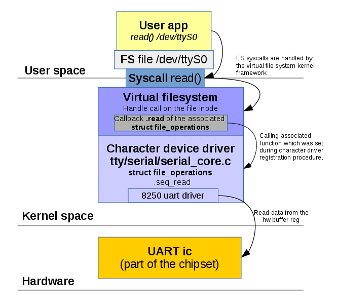
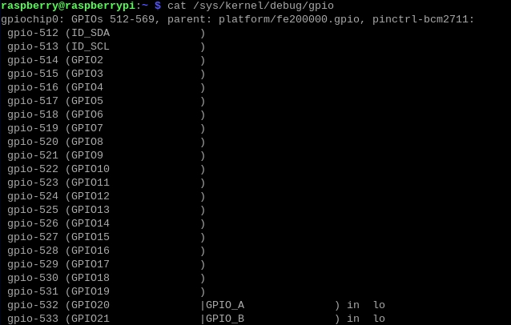
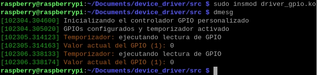
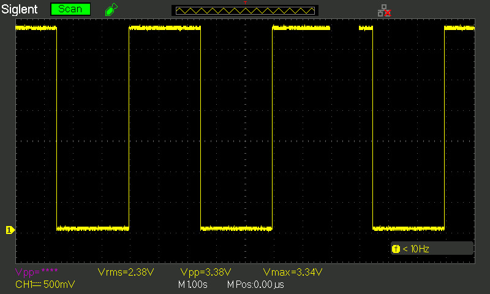
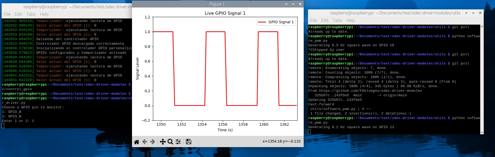

# Drivers de Kernel
Los drivers de caracteres
es de las formas mas simples de comunicarse al kernel de linux, se trabaja en módulos que pueden agregarse y desacoplarse de forma controlada. dando independencia al sistema de sus drivers en caso de falla.
Estos módulos actúan como intermediarios entre el espacio de usuario y el hardware o servicios del sistema, ofreciendo una abstracción que simplifica enormemente el desarrollo y mantenimiento de controladores.


## Implementacion:

en C99 la implementacion mas simple de operaciones de archivos es 

```C
    struct file_operations fops = {
       .read = device_read,
       .write = device_write,
       .open = device_open,
       .release = device_release
    };
```
**Conceptos**:
- **Major number**: Número principal que identifica el controlador de dispositivo
    
- **Minor number**: Número secundario que identifica dispositivos específicos manejados por el mismo controlador
    
- **sysfs**: Sistema de archivos virtual que representa información del kernel
    
- **nodo de dispositivo**: Archivo especial en /dev que permite interactuar con el dispositivo

Luego, haciendo uso de Major y Minor number, debemos registrar nuestro dispositivo en el sistema, de forma:

```C
void mychardev_init(void)
{
    int err, i;
    dev_t dev;

    // Asignar región de dispositivos de caracteres y asignar número Major
    err = alloc_chrdev_region(&dev, 0, MAX_DEV, "mychardev");

    dev_major = MAJOR(dev);

    // Crear clase en sysfs
    mychardev_class = class_create(THIS_MODULE, "mychardev");

    // Crear la cantidad necesaria de dispositivos
    for (i = 0; i < MAX_DEV; i++) {
        // Inicializar nuevo dispositivo
        cdev_init(&mychardev_data[i].cdev, &mychardev_fops);
        mychardev_data[i].cdev.owner = THIS_MODULE;

        // Añadir dispositivo al sistema donde "i" es el número Minor del nuevo dispositivo
        cdev_add(&mychardev_data[i].cdev, MKDEV(dev_major, i), 1);

        // Crear nodo de dispositivo /dev/mychardev-x donde "x" es "i", igual al número Minor
        device_create(mychardev_class, NULL, MKDEV(dev_major, i), NULL, "mychardev-%d", i);
    }
}
```


## Funciones de I/O
 Funciones de E/S para dispositivos de carácter
 Para interactuar con el archivo de dispositivo, necesitamos asignar funciones  a la estructura file_operations, que define cómo el kernel manejará las operaciones del dispositivo. 
```C
/*
 * Función: mychardev_open
 * Descripción: Se ejecuta cuando un proceso abre el dispositivo
 * Parámetros:
 *   - inode: Estructura que representa el archivo especial del dispositivo
 *   - file: Estructura que representa el archivo abierto
 * Retorna: 0 en éxito, código de error en caso contrario
 */
static int mychardev_open(struct inode *inode, struct file *file)
{
    printk("MYCHARDEV: Dispositivo abierto\n");
    return 0;
}

/*
 * Función: mychardev_release
 * Descripción: Se ejecuta cuando un proceso cierra el dispositivo
 * Parámetros:
 *   - inode: Estructura del archivo especial
 *   - file: Estructura del archivo abierto
 * Retorna: 0 en éxito, código de error en caso contrario
 */
static int mychardev_release(struct inode *inode, struct file *file)
{
    printk("MYCHARDEV: Dispositivo cerrado\n");
    return 0;
}

/*
 * Función: mychardev_ioctl
 * Descripción: Maneja operaciones de control específicas del dispositivo
 * Parámetros:
 *   - file: Estructura del archivo abierto
 *   - cmd: Comando de control específico del dispositivo
 *   - arg: Argumento pasado para el comando
 * Retorna: 0 en éxito, código de error en caso contrario
 */
static long mychardev_ioctl(struct file *file, unsigned int cmd, unsigned long arg)
{
    printk("MYCHARDEV: Operación ioctl en dispositivo\n");
    return 0;
}

/*
 * Función: mychardev_read
 * Descripción: Lee datos desde el dispositivo hacia el espacio de usuario
 * Parámetros:
 *   - file: Estructura del archivo abierto
 *   - buf: Buffer en espacio de usuario donde se copiarán los datos
 *   - count: Cantidad de bytes a leer
 *   - offset: Posición en el archivo desde donde leer
 * Retorna: Número de bytes leídos, o código de error
 */
static ssize_t mychardev_read(struct file *file, char __user *buf, size_t count, loff_t *offset)
{
    printk("MYCHARDEV: Lectura de dispositivo\n");
    return 0;
}

/*
 * Función: mychardev_write
 * Descripción: Escribe datos desde el espacio de usuario al dispositivo
 * Parámetros:
 *   - file: Estructura del archivo abierto
 *   - buf: Buffer en espacio de usuario con datos a escribir
 *   - count: Cantidad de bytes a escribir
 *   - offset: Posición en el archivo donde escribir
 * Retorna: Número de bytes escritos, o código de error
 */
static ssize_t mychardev_write(struct file *file, const char __user *buf, size_t count, loff_t *offset)
{
    printk("MYCHARDEV: Escritura en dispositivo\n");
    return 0;
}
```
La implementación realizada en el trabajo para el GPIO parte de las estructuras anteriormente expuestas.


# Conexión remota del dispositivo
Para este trabajo se implemento una overlay network de código libre llamada ZeroTier, de forma que cada integrante del equipo pudiera acceder a la raspberry pi.

Su funcionamiento de forma simplificada es el esquematizado en la siguiente imagen.


Para evitar el problema de abrir puertos en una NAT restringida, ZeroTier utiliza una técnica llamada *UDP Hole Punch*.

## Estructura de un Network ID de ZeroTier

``` mermaid
graph TD;
    A[8056c2e21c123456] --> B[Primeros 10 caracteres];
    A --> C[Últimos 6 caracteres];
    B --> D["Dirección ZeroTier del controlador"];
    C --> E["Número de red en el controlador"];
 ```

En detalle,

 **ZeroTier crea una VPN mesh**:
    
    - Todos los dispositivos se conectan entre sí mediante túneles cifrados (UDP).
        
    - No requiere configuración de puertos en el router (funciona detrás de NAT).
        
 **Asigna de IPs privadas**:
    
    - ZeroTier asigna direcciones IP únicas en la red virtual (`10.147.20.0/24`).
        
 **Cifra las conexiones**:
    
    -  **Cifrado AES-256**: Todos los datos viajan encriptados.
        
    - **Autenticación centralizada**: Solo dispositivos autorizados en ZeroTier Central pueden unirse.


Se puede leer mas en:

https://harivemula.com/2021/09/18/routing-all-traffic-through-home-with-zerotier-on-travel/
https://olegkutkov.me/2018/03/14/simple-linux-character-device-driver/

## SSH

A partir de la conexión de los dispositivos con Zero Tier, cada integrante de la red puede ver la Raspberry como si se tratara de un dispositivo en su propia red local, y conectarse con el mediante SSH usando

```bash
ssh raspberry@192.168.x.x
```

La IP de la Raspberry se puede encontrar utilizando la herramienta ```nmap```

```bash
nmap 192.168.x.x/24
```
Segun la red local de cada integrante del grupo.

# Driver GPIO

El driver GPIO se implementó junto con la API GPIO del kernel de Linux. A partir de la versión 6.2 del kernel Linux, se introdujeron cambios significativos en la forma en que se gestionan los pines GPIO en sistemas como la Raspberry Pi. Uno de los efectos más notables es que los números de los GPIO expuestos por el sistema pueden aparecer con valores altos, por ejemplo, superiores a 500. Este cambio se debe a la adopción del modelo de descriptores GPIO (GPIO descriptor framework) y a una asignación dinámica de los rangos de pines para cada controlador.

En versiones anteriores del kernel, los GPIO se numeraban de forma secuencial desde 0, lo que permitía acceder a ellos de manera sencilla usando su número absoluto.

Debido a esta nueva estructura, se deben utilizar herramientas como ```gpiodetect``` que permite acceder a los pines por nombre o por índice relativo dentro de un controlador específico.

```bash
gpiodetect        # Muestra los chips GPIO disponibles
gpioinfo          # Lista las líneas GPIO y sus nombres
```



### Build

El driver se puede compilar usando el comando ```make```. Una vez compilado lo podemos cargar con ```sudo insmod driver_gpio.ko```.



 Es posible utilizar comandos estándar como echo y cat, los cuales permiten enviar o recibir información según las operaciones de escritura y lectura implementadas por el driver.

Cuando se ejecuta un comando del tipo:

```bash
echo "1" > /dev/gpio_driver

```

el sistema realiza una operación de escritura sobre el archivo de dispositivo. Internamente, esto invoca la función write() definida en el driver correspondiente, pasando el contenido especificado (en este caso, "1") como un buffer de datos.

Por otro lado, al ejecutar un comando como:

```bash
cat /dev/gpio_driver
```

se realiza una lectura desde el dispositivo, lo que implica la invocación del método read() del driver. Este método es responsable de devolver una cadena de texto o datos binarios que representen el estado actual del dispositivo, en este caso el valor de una entrada en GPIO.

## Utilidades con Python

### Instalación de dependencias

Las dependencias de los scripts se instalan con 

```bash
pip install matplotlib pigpio
```

Se recomienda utilizar un entorno virtual.

### Uso
Para realizar de interfaz con el driver que se encuentra en ```/dev/control_gpio``` usamos

```sudo chmod a+rw /dev/control_gpio```

Existen varios scripts de Python que desarrollamos para el monitoreo del TP en la carpeta ```utils```:
- ```hardware_pwm.py```: es una prueba de concepto de control de PWM por hardware de la Raspberry Pi. Solo funciona para frecuencias mayor a 1, por lo que se obvió su uso
- ```software_pwm.py```: una implementación de PWM por software. Si admite frecuencias menores a 1.
- ```potter_driver.py```: un pequeño programa que grafica, por medio del driver ```control_gpio```, la entrada a los GPIO. Posee también un selector de entrada.



